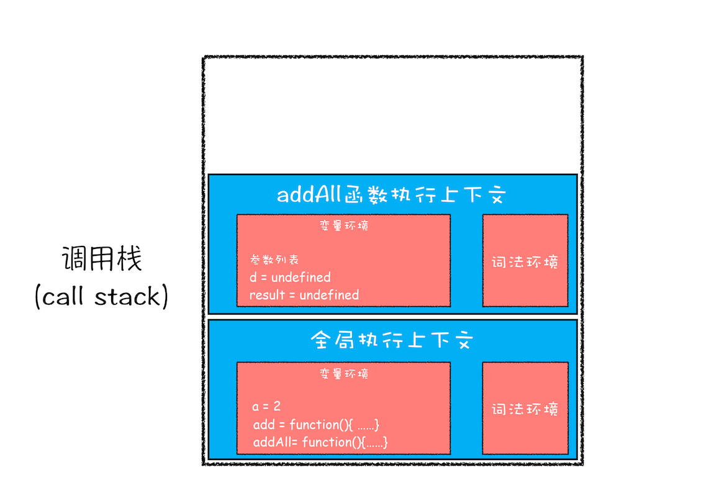
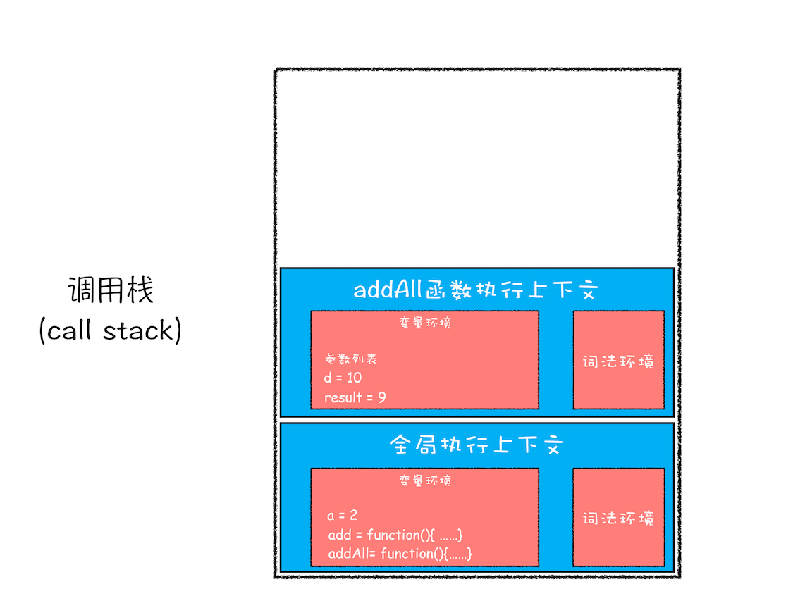
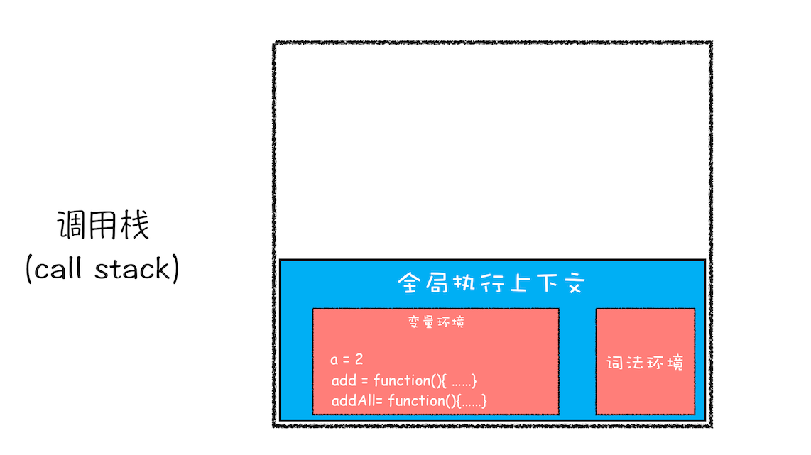

## 数据类型

有八种数据类型

Number、String、Boolean、Null、Undefined、Object、Symbol、BigInt。

- undefined 和 null

  undefined 表示为缺少值，未定义；null 表示为正常的或在意料之中的值的空缺

- Symbol

  Symbol 类型的对象永远不相等，即便创建的时候传入相同的值，可用于解决命名冲突问题。

```js
Symbol.for('helllo') === Symbol.for('helllo');
const a = new Symbol();
const b = new Symbol();
// a !== b
```

- BigInt

  BigInt 可以表示任意大的整数;

### 基本数据类型和引用数据类型

基本类型值指的是简单的数据段；引用类型值指那些可能由多个值构成的对象

基本类型：Number、String、Null、Undefined、Boolean、Symbol

引用类型：Object、Fuction、Array、Date 等

js 的变量的存储方式--栈（stack）和堆（heap）

栈：自动分配内存空间，系统自动释放，里面存放的是基本类型的值和引用类型的地址

堆：动态分配的内存，大小不定，也不会自动释放。里面存放引用类型的值。

基本类型的比较是值比较；引用类型的比较是引用的比较。

### 如何判断

主要有以下几种方法：typeof、instanceof 、Objeact.prototype.toString.call()。

- typeof

  返回一个表示数据类型的字符串，返回结果包含：number、boolean、string、symbol、object、undefined、function、bigint 等

  **不能判断 null 和 array**

- instanceof

  > instanceof 运算符用来测试一个对象在其原型链中是否存在一个构造函数的 prototype 属性。其意思就是判断对象是否是某一数据类型的实例

  **instanceof 可以精准判断引用数据类型（Array，Function，Object），而基本数据类型不能被 instanceof 精准判断。**

  ```js
  function newInstanceof(l, r) {
    var o = r.prototype;
    l = l.__proto__;
    while (true) {
      if (l === null) {
        return false;
      }
      if (o === l) {
        return true;
      }
      l = l.__proto__;
    }
  }
  ```

- Objeact.prototype.toString.call()

  最准确的判断方法

  ```js
  Object.prototype.toString.call(''); // [object String]
  Object.prototype.toString.call(1); // [object Number]
  Object.prototype.toString.call(true); // [object Boolean]
  Object.prototype.toString.call(Symbol()); // [object Symbol]
  Object.prototype.toString.call(undefined); // [object Undefined]
  Object.prototype.toString.call(null); // [object Null]
  Object.prototype.toString.call(new Function()); // [object Function]
  Object.prototype.toString.call(new Date()); // [object Date]
  Object.prototype.toString.call([]); // [object Array]
  Object.prototype.toString.call(new RegExp()); // [object RegExp]
  Object.prototype.toString.call(new Error()); // [object Error]
  Object.prototype.toString.call(document); // [object HTMLDocument]
  Object.prototype.toString.call(window); // [object global] window 是全局对象 global 的引用
  ```

## 原型和原型链

- 所有引用类型（函数、数组、对象）都拥有`__proto__`属性（隐式原型）
- 所有函数拥有`prototype`属性（显式原型）（仅限构造函数）
- 原型对象：拥有 prototype 属性的对象，在定义函数时被创建


## 执行机制

### 变量提升

在了解变量提升之前，先需要了解 JS 中的**声明**与**赋值**.下面用例子说明：

```javascript
var myname = 'Ye';

function foo() {
  console.log('foo');
}
var bar = function() {
  console.log('bar');
};
```

将上面代码转换成下面的样子

```javascript
var myname = undefiend // 声明
myname = 'ye' // 赋值

function foo = function(){ //声明
  console.log('foo')
}

var bar = undefined  // 声明
bar = function(){ // 赋值
  console.log('bar')
}
```

转换之后应该理解什么是**声明**与**赋值**了吧。

**所谓的变量提升，是指在 JavaScript 代码执行过程中，JavaScript 引擎把变量的声明部分和函数的声明部分提升到代码开头的“行为”。变量被提升后，会给变量设置默认值，这个默认值就是我们熟悉的 undefined。**

“变量提升”或者“函数提升“我们也把它们作为在执行一段代码之前的“准备工作”。

从概念的字面意义上来看，“变量提升”意味着变量和函数的声明会在物理层面移动到代码的最前面，正如我们所模拟的那样。但，这并不准确。实际上变量和函数声明在代码里的位置是不会改变的，而且是在编译阶段被 JavaScript 引擎放入内存中。如图所示


1. 编译阶段

   当输入一段代码，经过编译之后，会生成两部分内容：**执行上下文 Execution context）\*\*和\*\*可执行代码**

   执行上下文是 JavaScript 执行一段代码时的运行环境，比如调用一个函数，就会进入这个函数的执行上下文，确定该函数在执行期间用到的诸如 this、变量、对象以及函数等。

   如果在编译阶段，存在两个相同的函数，那么最终存放在变量环境中的是最后定义的那个，这是因为后定义的会覆盖掉之前定义的。例子说明

2. 执行阶段

   JavaScript 引擎开始执行“可执行代码”，按照顺序一行一行地执行。该阶段 JavaScript 引擎会从变量环境中去查找自定义的变量和函数。

### 执行上下文栈

JavaScript 引擎遇到一段怎样的代码时才会做“准备工作”，即创建执行上下文呢？

JavaScript 的可执行代码(executable code)的类型主要有：**全局代码、函数代码、eval 代码**

1. 当 JavaScript 执行全局代码的时候，会编译全局代码并创建全局执行上下文，而且在整个页面的生存周期内，全局执行上下文只有一份。
2. 当调用一个函数的时候，函数体内的代码会被编译，并创建函数执行上下文，一般情况下，函数执行结束之后，创建的函数执行上下文会被销毁。
3. 当使用 eval 函数的时候，eval 的代码也会被编译，并创建执行上下文

如何管理创建的那么多执行上下文？ JavaScript 引擎创建了执行上下文栈（Execution context stack，ECS）来管理执行上下文。

接下来用一段示例代码和图片来说明栈的工作机制：

```javascript
var a = 2;
function add(b, c) {
  return b + c;
}
function addAll(b, c) {
  var d = 10;
  result = add(b, c);
  return a + result + d;
}
addAll(3, 6);
```

1. 第一步，创建全局上下文，并将其压入栈底。如下图所示： 

   全局执行上下文压入到调用栈后，JavaScript 引擎便开始执行全局代码了。首先会执行 a=2 的赋值操作，执行该语句会将全局上下文变量环境中 a 的值设置为 2。设置后的全局上下文的状态如下图所示： 

2. 第二步 调用 addAll 函数 JavaScript 引擎会编译该函数，并为其创建一个执行上下文，最后还将该函数的执行上下文压入栈中，如下图所示：

    

   addAll 函数的执行上下文创建好之后，便进入了函数代码的执行阶段了，这里先执行的是 d=10 的赋值操作，执行语句会将 addAll 函数执行上下文中的 d 由 undefined 变成了 10。

3. 第三步，当执行到 add 函数 当调用该函数时,同样会为其创建执行上下文，并将其压入调用栈，如下图所示： 

4. 当 add 函数返回时，该函数的执行上下文就会从栈顶弹出，并将 result 的值设置为 add 函数的返回值，也就是 9。如下图所示：



5. 紧接着 addAll 执行最后一个相加操作后并返回，addAll 的执行上下文也会从栈顶部弹出，此时调用栈中就只剩下全局上下文了。最终如下图所示：

 

至此，整个 JavaScript 流程执行结束了。

#### 如何利用浏览器查看调用栈的信息

这里我们拿上面的那段代码做个演示，你可以打开“开发者工具”，点击“Source”标签，选择 JavaScript 代码的页面，然后在第 3 行加上断点，并刷新页面。你可以看到执行到 add 函数时，执行流程就暂停了，这时可以通过右边“call stack”来查看当前的调用栈的情况，如下图：

 

从图中可以看出，右边的“call stack”下面显示出来了函数的调用关系：栈的最底部是 anonymous，也就是全局的函数入口；中间是 addAll 函数；顶部是 add 函数。这就清晰地反映了函数的调用关系，所以在分析复杂结构代码，或者检查 Bug 时，调用栈都是非常有用的

除了通过断点来查看调用栈，你还可以使用 console.trace() 来输出当前的函数调用关系.

#### 栈溢出（Stack Overflow）

现在你知道了调用栈是一种用来管理执行上下文的数据结构，符合后进先出的规则。不过还有一点你要注意，**调用栈是有大小的**，当入栈的执行上下文超过一定数目，JavaScript 引擎就会报错，我们把这种错误叫做**栈溢出**。

栈溢出抛出的错误信息为：超过了最大栈调用大小（Maximum call stack size exceeded）

### 作用域

作用域是指程序源代码中定义变量的区域，规定了如何查找变量，也就是确定当前执行代码对变量的访问权限。

作用域主要分为**词法作用域**（静态作用域）和**动态作用域**。**JavaScript 采用的是词法作用域**。

函数的作用域在函数定义的时候就决定了，而如果是动态作用域，则是在调用的时候才决定，如下例子

```javascript
var value = 1;
function foo() {
  console.log(value);
}
function bar() {
  var value = 2;
  foo();
}
bar();

// 结果为 1
// 如果是动态作用域，则为2
```

在 ES6 之前，ES 的作用域只有两种：**全局作用域**和**函数作用域**。

- 全局作用域中的对象在代码中的任何地方都能访问，其生命周期伴随着页面的生命周期。
- 函数作用域就是在函数内部定义的变量或者函数，并且定义的变量或者函数只能在函数内部被访问。函数执行结束之后，函数内部定义的变量会被销毁。

为什么 ES6 需要支持块级作用域呢，主要是为了解决变量提升所带来的问题。

1. 变量容易在不被察觉的情况下被覆盖掉

   ```javascript
   var myname = 'ye';
   function showName() {
     console.log(myname);
     if (0) {
       var myname = 'ye1';
     }
     console.log(myname);
   }
   showName();
   ```

   很明显上述的答案为 undefined， 这输出的结果和其他大部分支持块级作用域的语言都不一样。如果你大学学过 c 语言，就会觉得这段好变扭。

2. 本应销毁的变量没有被销毁

   ```javascript
   function foo() {
     for (var i = 0; i < 7; i++) {}
     console.log(i);
   }
   foo();
   ```

   在 for 循环结束之后，i 就已经被销毁了，但是在 JavaScript 代码中，i 的值并未被销毁，所以最后打印出来的是 7

ES6 引入了 **let 和 const**关键字，使 JavaScript 像其他语言一样拥有块级作用域。

## this

【 默认绑定】严格模式下，不能将全局对象用于默认绑定，this 会绑定到 undefined。只有函数运行在非严格模式下，默认绑定才能绑定到全局对象。

【隐式绑定】函数的调用是在某个对象上触发的，即调用位置上存在上下文对象。典型的形式为 XXX.fun()，谁调用指向谁。

【显式绑定 】通过 call,apply,bind 的方式，显式的指定 this 所指向的对象

【new 绑定】使用 new 来调用函数，会自动执行下面的操作：

1. 创建（或者说构造）一个新对象。

2. 这个新对象会被执行[[Prototype]]连接。

3. 这个新对象会绑定到函数调用的 this。

4. 如果函数没有返回其他对象，那么 new 表达式中的函数调用会自动返回这个新对象。

   将 null 或者是 undefined 作为 this 的绑定对象传入 call、apply 或者是 bind,这些值在调用时会被忽略，实际应用的是默认绑定规则

箭头函数，箭头函数无法使用上述四条规则，而是根据外层（函数或者全局）作用域（词法作用域）来决定 this。

优先级：new 绑定 > 显式绑定 > 隐式绑定 > 默认绑定

## 闭包

## 事件循环

## 继承的方式

## 柯里化

## 事件流

## promise、generator、async await

## 0.1 + 0.2 为什么不等于 0.3 (IEEE754)

## 浮点精度
