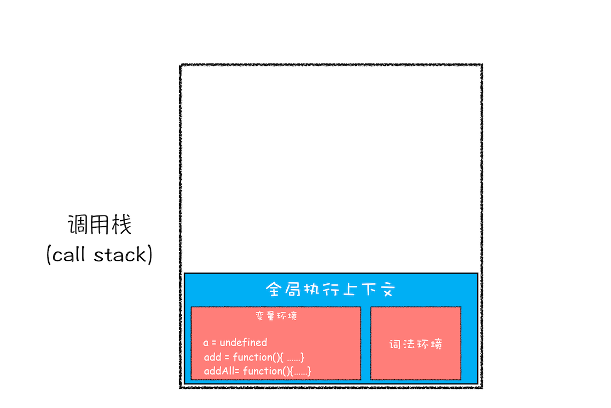

## 数据类型

有八种数据类型

Number、String、Boolean、Null、Undefined、Object、Symbol、BigInt。

- undefined 和 null

  undefined 表示为缺少值，未定义；null 表示为正常的或在意料之中的值的空缺

- Symbol

  Symbol 类型的对象永远不相等，即便创建的时候传入相同的值，可用于解决命名冲突问题。

```js
Symbol.for('helllo') === Symbol.for('helllo');
const a = new Symbol();
const b = new Symbol();
// a !== b
```

- BigInt

  BigInt 可以表示任意大的整数;

### 基本数据类型和引用数据类型

基本类型值指的是简单的数据段；引用类型值指那些可能由多个值构成的对象

基本类型：Number、String、Null、Undefined、Boolean、Symbol

引用类型：Object、Fuction、Array、Date 等

js 的变量的存储方式--栈（stack）和堆（heap）

栈：自动分配内存空间，系统自动释放，里面存放的是基本类型的值和引用类型的地址

堆：动态分配的内存，大小不定，也不会自动释放。里面存放引用类型的值。

基本类型的比较是值比较；引用类型的比较是引用的比较。

### 如何判断

主要有以下几种方法：typeof、instanceof 、Objeact.prototype.toString.call()。

- typeof

  返回一个表示数据类型的字符串，返回结果包含：number、boolean、string、symbol、object、undefined、function、bigint 等

  **不能判断 null 和 array**

- instanceof

  > instanceof 运算符用来测试一个对象在其原型链中是否存在一个构造函数的 prototype 属性。其意思就是判断对象是否是某一数据类型的实例

  **instanceof 可以精准判断引用数据类型（Array，Function，Object），而基本数据类型不能被 instanceof 精准判断。**

  ```js
  function newInstanceof(l, r) {
    var o = r.prototype;
    l = l.__proto__;
    while (true) {
      if (l === null) {
        return false;
      }
      if (o === l) {
        return true;
      }
      l = l.__proto__;
    }
  }
  ```

- Objeact.prototype.toString.call()

  最准确的判断方法

  ```js
  Object.prototype.toString.call(''); // [object String]
  Object.prototype.toString.call(1); // [object Number]
  Object.prototype.toString.call(true); // [object Boolean]
  Object.prototype.toString.call(Symbol()); // [object Symbol]
  Object.prototype.toString.call(undefined); // [object Undefined]
  Object.prototype.toString.call(null); // [object Null]
  Object.prototype.toString.call(new Function()); // [object Function]
  Object.prototype.toString.call(new Date()); // [object Date]
  Object.prototype.toString.call([]); // [object Array]
  Object.prototype.toString.call(new RegExp()); // [object RegExp]
  Object.prototype.toString.call(new Error()); // [object Error]
  Object.prototype.toString.call(document); // [object HTMLDocument]
  Object.prototype.toString.call(window); // [object global] window 是全局对象 global 的引用
  ```

## 原型和原型链

- 所有引用类型（函数、数组、对象）都拥有`__proto__`属性（隐式原型）
- 所有函数拥有`prototype`属性（显式原型）（仅限构造函数）
- 原型对象：拥有 prototype 属性的对象，在定义函数时被创建


## 闭包

> 1. 从理论角度：所有的函数。因为它们都在创建的时候就将上层上下文的数据保存起来了。哪怕是简单的全局变量也是如此，因为函数中访问全局变量就相当于是在访问自由变量，这个时候使用最外层的作用域。
> 2. 从实践角度：以下函数才算是闭包：
>    1. 即使创建它的上下文已经销毁，它仍然存在（比如，内部函数从父函数中返回）
>    2. 在代码中引用了自由变量

## 执行机制

### 变量提升

在了解变量提升之前，先需要了解 JS 中的**声明**与**赋值**.下面用例子说明：

```javascript
var myname = 'Ye';

function foo() {
  console.log('foo');
}
var bar = function() {
  console.log('bar');
};
```

将上面代码转换成下面的样子

```javascript
var myname = undefiend // 声明
myname = 'ye' // 赋值

function foo = function(){ //声明
  console.log('foo')
}

var bar = undefined  // 声明
bar = function(){ // 赋值
  console.log('bar')
}
```

转换之后应该理解什么是**声明**与**赋值**了吧。

**所谓的变量提升，是指在 JavaScript 代码执行过程中，JavaScript 引擎把变量的声明部分和函数的声明部分提升到代码开头的“行为”。变量被提升后，会给变量设置默认值，这个默认值就是我们熟悉的 undefined。**

“变量提升”或者“函数提升“我们也把它们作为在执行一段代码之前的“准备工作”。

从概念的字面意义上来看，“变量提升”意味着变量和函数的声明会在物理层面移动到代码的最前面，正如我们所模拟的那样。但，这并不准确。实际上变量和函数声明在代码里的位置是不会改变的，而且是在编译阶段被 JavaScript 引擎放入内存中。如图所示


1. 编译阶段

   当输入一段代码，经过编译之后，会生成两部分内容：**执行上下文 Execution context）\*\*和\*\*可执行代码**

   执行上下文是 JavaScript 执行一段代码时的运行环境，比如调用一个函数，就会进入这个函数的执行上下文，确定该函数在执行期间用到的诸如 this、变量、对象以及函数等。

   如果在编译阶段，存在两个相同的函数，那么最终存放在变量环境中的是最后定义的那个，这是因为后定义的会覆盖掉之前定义的。例子说明

2. 执行阶段

   JavaScript 引擎开始执行“可执行代码”，按照顺序一行一行地执行。该阶段 JavaScript 引擎会从变量环境中去查找自定义的变量和函数。

### 执行上下文栈

JavaScript 引擎遇到一段怎样的代码时才会做“准备工作”，即创建执行上下文呢？

JavaScript 的可执行代码(executable code)的类型主要有：**全局代码、函数代码、eval 代码**

1. 当 JavaScript 执行全局代码的时候，会编译全局代码并创建全局执行上下文，而且在整个页面的生存周期内，全局执行上下文只有一份。
2. 当调用一个函数的时候，函数体内的代码会被编译，并创建函数执行上下文，一般情况下，函数执行结束之后，创建的函数执行上下文会被销毁。
3. 当使用 eval 函数的时候，eval 的代码也会被编译，并创建执行上下文

如何管理创建的那么多执行上下文？ JavaScript 引擎创建了执行上下文栈（Execution context stack，ECS）来管理执行上下文。

接下来用一段示例代码和图片来说明栈的工作机制：

```javascript
var a = 2;
function add(b, c) {
  return b + c;
}
function addAll(b, c) {
  var d = 10;
  result = add(b, c);
  return a + result + d;
}
addAll(3, 6);
```

1. 第一步，创建全局上下文，并将其压入栈底。如下图所示： 

   全局执行上下文压入到调用栈后，JavaScript 引擎便开始执行全局代码了。首先会执行 a=2 的赋值操作，执行该语句会将全局上下文变量环境中 a 的值设置为 2。设置后的全局上下文的状态如下图所示： 

2. 第二步 调用 addAll 函数 JavaScript 引擎会编译该函数，并为其创建一个执行上下文，最后还将该函数的执行上下文压入栈中，如下图所示：

    

   addAll 函数的执行上下文创建好之后，便进入了函数代码的执行阶段了，这里先执行的是 d=10 的赋值操作，执行语句会将 addAll 函数执行上下文中的 d 由 undefined 变成了 10。

3. 第三步，当执行到 add 函数 当调用该函数时,同样会为其创建执行上下文，并将其压入调用栈，如下图所示： 

4. 当 add 函数返回时，该函数的执行上下文就会从栈顶弹出，并将 result 的值设置为 add 函数的返回值，也就是 9。如下图所示：


5. 紧接着 addAll 执行最后一个相加操作后并返回，addAll 的执行上下文也会从栈顶部弹出，此时调用栈中就只剩下全局上下文了。最终如下图所示：

 

至此，整个 JavaScript 流程执行结束了。

#### 如何利用浏览器查看调用栈的信息

这里我们拿上面的那段代码做个演示，你可以打开“开发者工具”，点击“Source”标签，选择 JavaScript 代码的页面，然后在第 3 行加上断点，并刷新页面。你可以看到执行到 add 函数时，执行流程就暂停了，这时可以通过右边“call stack”来查看当前的调用栈的情况，如下图：

 

从图中可以看出，右边的“call stack”下面显示出来了函数的调用关系：栈的最底部是 anonymous，也就是全局的函数入口；中间是 addAll 函数；顶部是 add 函数。这就清晰地反映了函数的调用关系，所以在分析复杂结构代码，或者检查 Bug 时，调用栈都是非常有用的

除了通过断点来查看调用栈，你还可以使用 console.trace() 来输出当前的函数调用关系.

#### 栈溢出（Stack Overflow）

现在你知道了调用栈是一种用来管理执行上下文的数据结构，符合后进先出的规则。不过还有一点你要注意，**调用栈是有大小的**，当入栈的执行上下文超过一定数目，JavaScript 引擎就会报错，我们把这种错误叫做**栈溢出**。

栈溢出抛出的错误信息为：超过了最大栈调用大小（Maximum call stack size exceeded）

### 作用域

作用域是指程序源代码中定义变量的区域，规定了如何查找变量，也就是确定当前执行代码对变量的访问权限。

作用域主要分为**词法作用域**（静态作用域）和**动态作用域**。**JavaScript 采用的是词法作用域**。

函数的作用域在函数定义的时候就决定了，而如果是动态作用域，则是在调用的时候才决定，如下例子

```javascript
var value = 1;
function foo() {
  console.log(value);
}
function bar() {
  var value = 2;
  foo();
}
bar();

// 结果为 1
// 如果是动态作用域，则为2
```

在 ES6 之前，ES 的作用域只有两种：**全局作用域**和**函数作用域**。

- 全局作用域中的对象在代码中的任何地方都能访问，其生命周期伴随着页面的生命周期。
- 函数作用域就是在函数内部定义的变量或者函数，并且定义的变量或者函数只能在函数内部被访问。函数执行结束之后，函数内部定义的变量会被销毁。

为什么 ES6 需要支持块级作用域呢，主要是为了解决变量提升所带来的问题。

1. 变量容易在不被察觉的情况下被覆盖掉

   ```javascript
   var myname = 'ye';
   function showName() {
     console.log(myname);
     if (0) {
       var myname = 'ye1';
     }
     console.log(myname);
   }
   showName();
   ```

   很明显上述的答案为 undefined， 这输出的结果和其他大部分支持块级作用域的语言都不一样。如果你大学学过 c 语言，就会觉得这段好变扭。

2. 本应销毁的变量没有被销毁

   ```javascript
   function foo() {
     for (var i = 0; i < 7; i++) {}
     console.log(i);
   }
   foo();
   ```

   在 for 循环结束之后，i 就已经被销毁了，但是在 JavaScript 代码中，i 的值并未被销毁，所以最后打印出来的是 7

ES6 引入了 **let 和 const**关键字，使 JavaScript 像其他语言一样拥有块级作用域。

### 作用域链

> 当代码在一个环境中执行时，会创建变量对象的一个作用域链。作用域的用途，是保证对执行环境有权访问的所有变量和函数的有序访问。作用域的前端，始终都是当前执行的代码所在环境的变量对象。作用域链中的下一个变量对象来自包含（外部）环境，则再一个变量对象则来自下一个包含环境。这样，一直延续到全局执行环境；全局执行环境的变量对象始终都是作用域链中的最后一个对象

由多个执行上下文的变量对象构成的链表就叫做作用域链.

当一个函数执行时，当访问某个变量时，会先在当前定义函数内查找 ，没有查找到向上一层查找。

JS 采用的是词法作用域，所以函数的作用域在函数定义的时候就决定了。这是因为函数有一个内部属性[[scope]], 当函数创建的时候，就会保存所有父变量对象到其中，你可以理解[[scope]]就是所有父变量对象的层级链，但注意[[scope]]并不代表完整的作用域链。

## this

【 默认绑定】严格模式下，不能将全局对象用于默认绑定，this 会绑定到 undefined。只有函数运行在非严格模式下，默认绑定才能绑定到全局对象。

【隐式绑定】函数的调用是在某个对象上触发的，即调用位置上存在上下文对象。典型的形式为 XXX.fun()，谁调用指向谁。

【显式绑定 】通过 call,apply,bind 的方式，显式的指定 this 所指向的对象

【new 绑定】使用 new 来调用函数，会自动执行下面的操作：

1. 创建（或者说构造）一个新对象。

2. 这个新对象会被执行[[Prototype]]连接。

3. 这个新对象会绑定到函数调用的 this。

4. 如果函数没有返回其他对象，那么 new 表达式中的函数调用会自动返回这个新对象。

   将 null 或者是 undefined 作为 this 的绑定对象传入 call、apply 或者是 bind,这些值在调用时会被忽略，实际应用的是默认绑定规则

5. 箭头函数，箭头函数无法使用上述四条规则，而是根据外层（函数或者全局）作用域（词法作用域）来决定 this。

```javascript
function foo() {
  // 返回一个箭头函数
  return a => {
    // this继承自foo()
    console.log(this.a);
  };
}

var obj1 = {
  a: 2,
};

var obj2 = {
  a: 3,
};

var bar = foo.call(obj1);
bar.call(obj2); // 2，不是3！
```

优先级：new 绑定 > 显式绑定 > 隐式绑定 > 默认绑定

## 浏览器与 node 的事件循环

### 浏览器

- macro-task（宏任务） 大概包括：

  - script（整体代码）
  - setTimeout
  - setInterval
  - setImmediate
  - I / O
  - UI render

- micro-task（微任务） 大概包括：
  - process.nextTick
  - Promise.then
  - async / await （等价于 Promise.then）
  - MutationObserver（HTML5 新特性）

**整体顺序**

1. 执行宏任务

2. 然后执行宏任务产生的微任务

3. 若微任务在执行过程中产生了新的微任务，则继续执行微任务

4. 微任务执行完毕，再回到宏任务中进行下一轮循环

**浏览器里的时间循环，遇到宏任务，会立即执行对应的微任务队列**

**关于 async / await 执行顺序** <br/>
我们知道  async  会隐式返回一个 Promise 作为结果的函数，那么可以简单理解为：**await 后面的函数在执行完毕后**，await 会产生一个微任务（Promise.then 是微任务）。但是我们要注意微任务产生的时机，它是执行完 await 后，直接跳出 async 函数，执行其他代码（此处就是协程的运作，A 暂停执行，控制权交给 B）。其他代码执行完毕后，再回到 async 函数去执行剩下的代码，然后把 await 后面的代码注册到微任务队列中

**旧版 chrome：** <br/>
​ 在执行到 await 时，会将 await 后面代码放到本轮循环最后执行；

**新版 chrome**：<br/>
分两种情况（优化 await 的运行速度）<br/>
如果 await 后不是异步任务，将 await 后看成是一个微任务<br/>
如果 await 后是异步任务，将 await 后面代码放到本轮循环最后执行

### Node

事件循环机制被分成好多个阶段，每个阶段执行特定的任务

- macro-task（宏任务）包括：
  - setTimeout
  - setInterval
  - setImmediate
  - script（整体代码）
  - I / O 操作
- micro-task（微任务）包括：
  - process.nextTick（与普通微任务有区别，在微任务队列执行之前执行）
  - Promise.then 回调

process.nextTick 是独立于事件循环的任务队列，在每一个事件循环阶段完成后会去检查 nextTick 队列，如果里面有任务，会让这部分任务优先于微任务执行。

**Node11 之前：** <br/>
会执行所有的宏任务，再执行微任务，其中 process.nextTick 优先于其他微任务先执行

**Node11 ：** <br/>
​ 如果是 node11 版本一旦执行一个阶段里的一个宏任务（setTimeout、setInterval、setImmediate）就会立刻执行对应的微任务队列，nextTick 也会优先其他微任务先执行。
​ Node11 之后它的特性向浏览器看齐！

### 总结

两者主要的区别在于浏览器中的微任务是在每个相应的宏任务中执行的，而 nodejs 中的微任务则是在不同阶段之间执行的。可以理解 node 中存在着优先级的执行顺序

## 继承

### 原型链继承

核心：父类的实例作为子类的原型

```javascript
function Animal(name) {
  this.name = name || 'Tom';
  this.colors = ['red', 'bule'];
}
Animal.prototype.sayName = function(food) {
  return this.name;
};

function Cat() {}
Cat.prototype = new Animal(); // 关键

var cat = new Cat();

console.log(cat.sayName); // Tom
console.log(cat instanceof Animal); // true
console.log(cat instanceof Cat); // true
```

优点

1. 非常简单的继承关系，实例是子类的实例，也是父类的实例
2. 父类新增原型方法/属性，子类都能访问到

缺点

1. 子类型重写超类型中的方法，或者添加超类型中不存在的方法。给原型添加/重写方法的代码一定要放在替换原型的语句之后。

2. 引用类型的属性被所有实例共享

   ```
   function Animal(name) {
       this.name = name || 'Tom'
       this.colors = ['red', 'bule']
   }

   Animal.prototype.sayName = function() {
       return this.name
   }

   var cat1 = new Cat()
   cat1.colors.push('white')
   console.log(cat1.colors) // ['red','bule','white']

   var cat2 = new Cat()
   console.log(cat2.colors) // ['red','bule','white']
   ```

3. 创建子类实例时，无法向父类构造函数传参

4. 无法实现多继承

### 借用构造函数继承/经典继承

```javascript
function Animal(name) {
  this.name = name || 'Tom';
  this.colors = ['red', 'bule'];
}

Animal.prototype.sayName = function() {
  return this.name;
};

function Cat(name) {
  Animal.call(this, name); // 可以向父类传参
}
var cat1 = new Cat('Tom');
var cat2 = new Cat('Jack');

cat1.colors.push('white');

console.log(cat1.colors); // ['red','bule','white']
console.log(cat2.colors); // ['red','bule']
console.log(cat1.name); // Tom
console.log(cat2.name); // Jack
console.log(cat1 instanceof Animal); // false
console.log(cat1.sayName()); // Uncaught TypeError: cat1.sayName is not a function
```

优点

1. 避免了引用类型的属性被所有实例共享

2. 可以在 Child 中向 Parent 传参
3. 可以继承多个父类

缺点

1. 实例是子类实例，不是父类实例 `console.log(cat1 instanceof Animal); // false`
2. 并没有继承父类原型上的方法 `console.log(cat1.sayName()) // Uncaught TypeError: cat1.sayName is not a function`
3. 方法都在构造函数中定义，每次创建实例都会创建一遍方法。

### 组合继承

原型链和借用构造函数的组合，思路是使用原型链实现对父类原型属性和方法的继承，而通过借用构造函数来实现对实例属性的继承。

```javascript
function Animal(name) {
  this.name = name || 'Tom';
  this.colors = ['red', 'bule'];
}

Animal.prototype.sayName = function() {
  return this.name;
};

function Cat(name, age) {
  // 继承属性
  Animal.call(this, name); //第二次调用Animal() 父类构造器
  this.age = age;
}

Cat.prototype = new Animal(); //第一次调用Animal() 父类构造器
Cat.prototype.constructor = Cat;

// 继承属性
Cat.prototype.sayAge = function() {
  return this.age;
};

var cat1 = new Cat('Jack', 18);
var cat2 = new Cat('Rose', 19);

cat1.colors.push('white');

console.log(cat1.colors); // ['red','blue','white']
console.log(cat2.colors); // ['red','blue']
console.log(cat1.sayName()); // 'Jack'
console.log(cat2.sayName()); // Rose
console.log(cat1.sayAge()); // 18
console.log(cat2.sayAge()); // 19
```

优点：融合原型链继承和构造函数的优点，是 JavaScript 中最常用的继承模式。

缺点：调用两次父构造函数。

### 原型式继承

借助原型可以基于已有的对象创建新的对象，同时还不必因此创建自定义类型。

```javascript
function object(o) {
  function F() {}
  F.prototype = o;
  return new F();
}
```

ES5 Object.create 的模拟实现，将传入的对象作为创建的对象的原型

缺点

与原型链继承一样, 各个实例中**引用类型的属性值**会共享相应的值

```javascript
var person = {
  name: 'Tom',
  friends: ['Jack', 'Rose'],
};

var person1 = object(person);
var person2 = object(person);

person1.name = 'person1';
console.log(person2.name); // Tom

person1.firends.push('Tisa');
console.log(person2.friends); // ["Jack", "Rose", "Tisa"]
```

### 寄生式继承

```javascript
// 创建一个仅用于封装继承过程的函数，该函数在内部以某种形式来做增强对象，最后返回对象。
function createObj(o) {
  var clone = Object.create(o);
  clone.sayName = function() {
    console.log('hi');
  };
  return clone;
}
```

缺点：跟借用构造函数模式一样，每次创建对象都会创建一遍方法。

### 寄生组合式继承

```javascript
//寄生组合式继承的核心方法s
function inheritPrototype(subType, superType) {
  // 继承父类的原型
  var prototype = Object.create(superType.prototype);
  // 重写被污染的子类的constructor
  prototype.constructor = subType;
  // 重写子类的原型
  supType.prototype = prototype;
}

/*
1. 子类继承了父类的属性和方法，同时，属性没有被创建在原型链上，因此多个子类不会共享同一个属性；
2. 子类可以传递动态参数给父类；
3. 父类的构造函数只执行了一次。
4. 能正常使用 instanceof 和 isPrototypeOf()
*/
```

参考地址：

https://github.com/mqyqingfeng/Blog/issues/16

## 柯里化

## DOM 事件

### 事件级别

事件级别可以分为：DOM0 级事件、DOM2 级事件、DOM3 级事件

#### DOM 0 级事件

DOM 0 级： 写法：el.οnclick=function(){}

当希望为同一个元素/标签绑定多个同类型事件的时候，是不被允许的。DOM0 事件绑定，给元素的事件行为绑定方法，这些方法都是在当前元素事件行为的冒泡阶段(或者目标阶段)执行的。

#### DOM 2 级事件

DOM 2 级 写法：el.addEventListener(event-name, callback, useCapture)

1. event-name: 事件名称，可以是标准的 DOM 事件
2. callback: 回调函数，当事件触发时，函数会被注入一个参数为当前的事件对象 event
3. useCapture: 默认是 false，代表事件句柄在冒泡阶段执行

DOM 2 级 可以为同一个元素绑定多个事件

#### DOM 3 级事件

DOM 3 级 写法和 DOM2 级一致 只是在 DOM 2 级事件的基础上添加了更多的事件类型

列如 load、scroll 等

### 事件流

事件流描述的是从页面中接收事件的顺序。事件流模型可以分为事件冒泡和事件捕获两种。

1. **事件冒泡**

事件冒泡既事件开始时由最具体的元素接收，然后逐级向上传播到较为不具体的节点。这种事件流的概念由 IE 提出

1. **事件捕获**

事件捕获的思想 是不太具体的节点应该更早接收到事件，而最具体的节点应该最后接收到事件。

事件流可以分为三个阶段：

1. 捕获阶段：事件从 window 对象自上而下向目标节点传播的阶段；
2. 目标阶段：真正的目标节点正在处理事件的阶段；
3. 冒泡阶段：事件从目标节点自下而上向 window 对象传播的阶段

#### 事件委托

由于事件会在冒泡阶段向上传播到父节点，因此可以把子节点的监听函数定义在父节点上，由父节点的监听函数统一处理多个子元素的事件。这种方法叫做事件的代理（delegation）

这种做可以达到：

1. 减少内存消耗，提高性能(不需要为每一个子元素绑定事件)
2. 动态绑定事件

#### Event 对象使用

1. 阻止默认行为：event. preventDefault()

   什么是默认事件呢？例如表单一点击提交按钮(submit)跳转页面、a 标签默认页面跳转或是锚点定位等

2. 阻止冒泡

   event.stopPropagation() 方法阻止事件冒泡到父元素，阻止任何父事件处理程序被执行

   stopImmediatePropagation 既能阻止事件向父元素冒泡，也能阻止元素同事件类型的其它监听器被触发

   e.cancelBubble=true; IE 下阻止冒泡

3. event.target 和 event.currentTarget

   event.currentTarget 始终是监听事件者，而 event.target 是事件的真正发出者

## promise、generator、async await

## 0.1 + 0.2 为什么不等于 0.3 (IEEE754)

## 浮点精度
