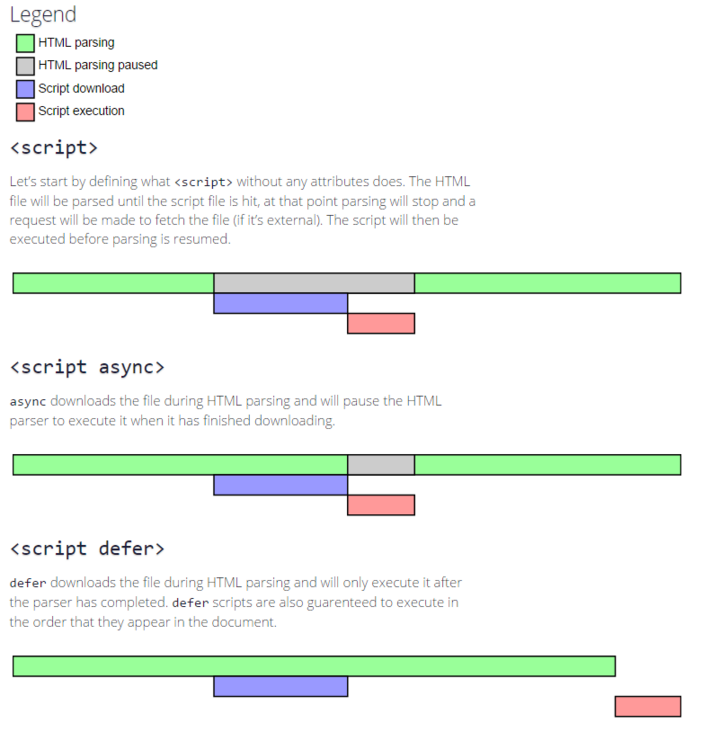

## 语义化

Web 语义化是指使用恰当语义的 html 标签、class 类名等内容，让页面具有良好的结构与含义，从而让人和机器都能快速理解网页内容。

语义化的 web 页面一方面可以让机器在更少的人类干预情况下收集并研究网页的信息，从而可以读懂网页的内容，然后将收集汇总的信息进行分析，结果为人类所用；另一方面它可以让开发人员读懂结构和用户以及屏幕阅读器（如果访客有视障）能够读懂内容。
简单来说就是利于 SEO，便于阅读维护理解，总结一下：

- 正确的标签做正确的事情
- 页面内容结构化
- 无 CSS 样子时也容易阅读，便于阅读维护和理解
- 便于浏览器、搜索引擎解析。 利于爬虫标记、利于 SEO

HTML 语义化是反对大篇幅使用无语义化的 div+span+class，而鼓励使用 HTML 定义好的语义化标签，如：body, article, nav, aside, section, header, footer

此外，语义化除了 html 标签语义化也包含了 css 命名语义化、URL 语义化。语义化的命名能够便于阅读和维护。

## meta 标签相关

```html
<!--指定字符编码 -->
<meta charset="UTF-8" />

<!-- viewport常见设置，一般适用于移动端。视口宽度设为理想宽度，禁止缩放 -->
<meta
  name="viewport"
  content="width=device-width,initial-scale=1.0,maximum-scale=1.0,user-scalable=no"
/>

<!-- 页面描述、关键词、作者 -->
<meta name="description" content="hello" />
<meta name="keyword" content="hello" />
<meta name="author" content="hello" />

<!-- 忽略页面中的数字识别为电话，忽略email识别-->
<meta name="format-detection" content="telphone=no, email=no" />

<!-- 设置页面不缓存 -->
<meta http-equiv="”pragma”" content="”no-cache”" />
<meta http-equiv="”cache-control”" content="”no-cache”" />
<meta http-equiv="”expires”" content="”0″" />
```

[meta doc](https://developer.mozilla.org/zh-CN/docs/Web/HTML/Element/meta)

## HTML5 新增

- 结构标签

  - section：独立内容区块，可以用 h1~h6 组成大纲，表示文档结构，也可以有章节、页眉、页脚或页眉的其他部分
  - article：特殊独立区块，表示这篇页眉中的核心内容
  - aside：标签内容之外与标签内容相关的辅助信息
  - header：某个区块的头部信息/标题
  - hgroup：头部信息/标题的补充内容
  - footer：底部信息
  - nav：导航条部分信息
  - figure：独立的单元，例如某个有图片与内容的新闻块

- 表单标签

  - email：必须输入邮件
  - url：必须输入 url 地址
  - number：必须输入数值
  - range：必须输入一定范围内的数值；
  - Date Pickers：日期选择器
  - search：搜索常规的文本域
  - color：颜色

- 媒体标签
  - video：视频
  - audio：音频
  - embed：嵌入内容（包括各种媒体），Midi、Wav、AU、MP3、Flash、AIFF 等。

[HTML 元素](https://developer.mozilla.org/zh-CN/docs/Web/HTML/Element)

## defer 和 async


