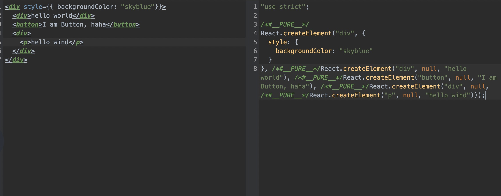
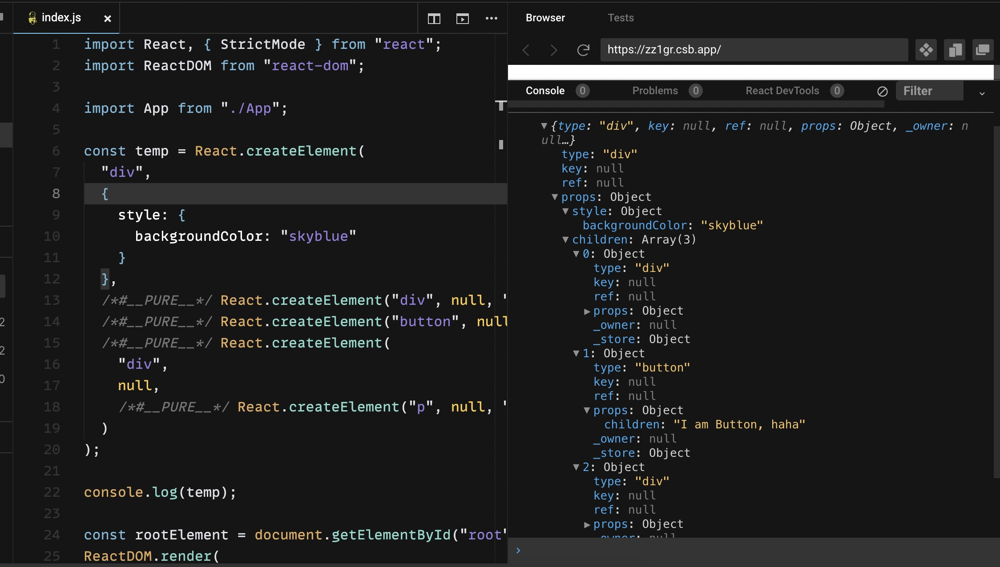
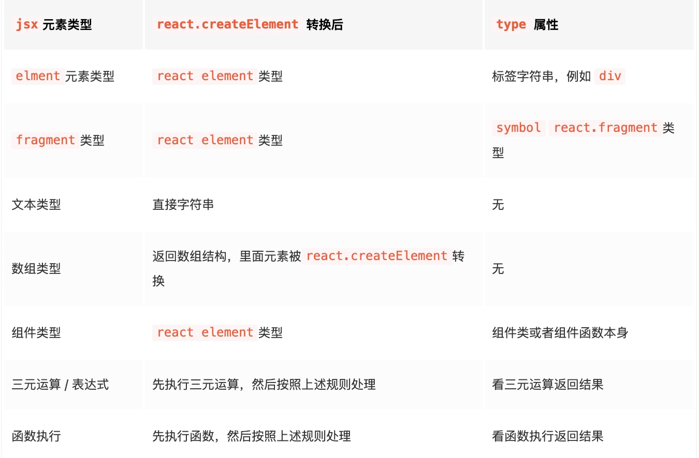

## JSX

写一段普通的 jsx

```html
<div style={{ backgroundColor: 'skyblue' }}>
  <div>hello world</div>
  <button>I am Button, haha</button>
  <div>
    <p>hello wind</p>
  </div>
</div>
```

### 经过 babel 编译处理后



得到 React.createElement 调用的形式（所以老版本的 React，开发是需要在文件开头引入 React）。

createElement 函数参数如下

- 组件类型，会传入组件对应的类或函数；如果是 dom 元素类型，传入 div 或者 span 之类的字符串。

- 第二个参数：一个对象，在 dom 类型中为标签属性，在组件类型中为 props 。

- 其他参数：依次为 children，根据顺序排列。

2. React.createElement 调用
3. 经过 React 的调和处理

### React.createElement 调用

react.createElement 调用后转换成 react element 对象：

<div style="text-align: left">


</div>

### React 调和处理

在调和阶段，React element 对象的每一个子节点都会形成一个与之对应的 fiber 对象，然后通过 sibling、return、child 将每一个 fiber 对象联系起来。

React 针对不同 React element 对象会产生不同 tag (种类) 的 fiber 对象。

jsx 最终形成一个 fiber 的结构。

#### React Fiber 类型

### 总结

我们写的 JSX

1. 经过 Babel 编译，会先变成 React.createElement 的形式
2. 经 React.createElement 会先转换成 React.element，
3. 紧接着在调和阶段，React element 对象的每一个子节点都会形成一个与之对应的 fiber 对象，然后通过 sibling、return、child 将每一个 fiber 对象联系起来，最终形成一个 fiber 结构。

## component

## state

## props

## lifeCycle
