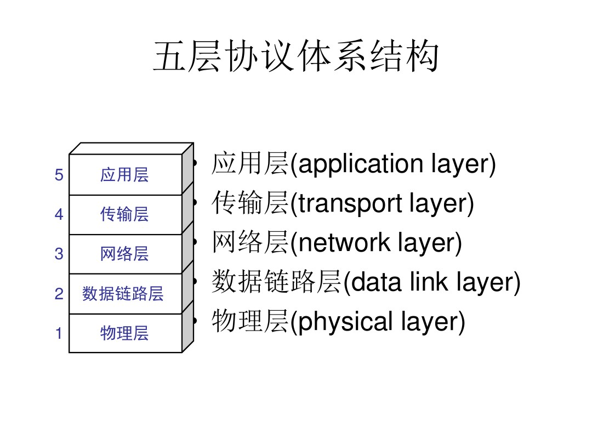

推荐小林 codeing 的《图解网络》

## 网咯分层

应用层、传输层、网络层、数据链路层、物理层

### 应用层

http、ftp、Telnet

### 传输层

应用层的数据包会传输给应用层、为应用层提供传输的服务。
主要有以下协议

- TCP

- UDP

### 网络层

IP 协议

### 数据链路层：

### 物理层

## http 和 https 握手

## https 为什么安全

## http2 的特点

## tcp 阻塞

## http 状态码

## http3
