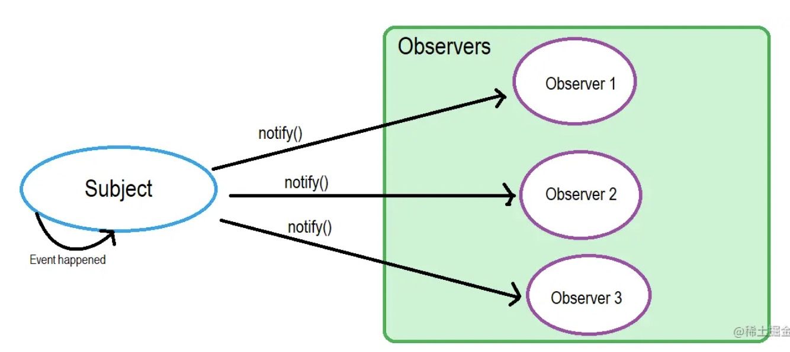
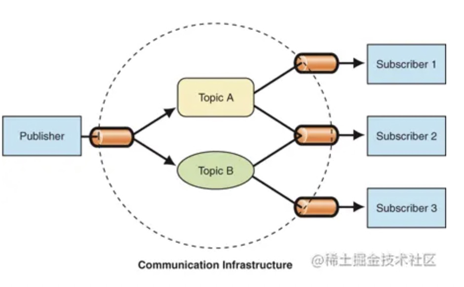
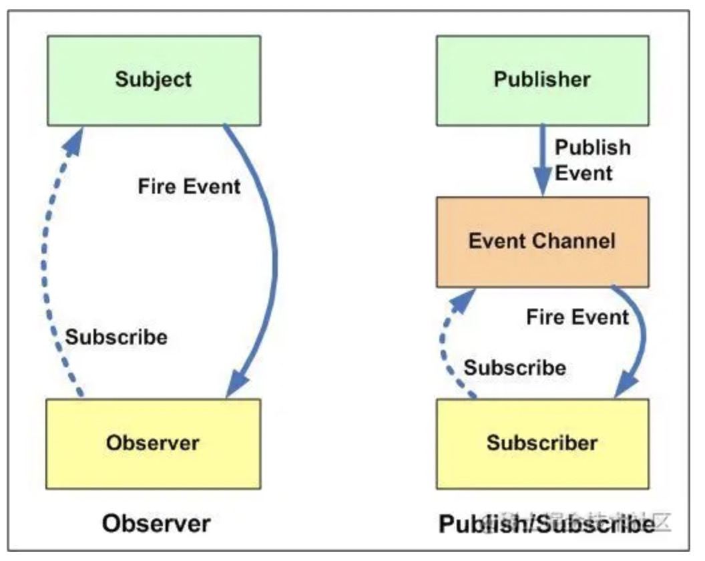

## 观察者模式、发布订阅模式

### 观察者模式

#### 定义

> **观察者模式** 在软件设计中是一个对象，维护一个依赖列表，当任何状态发生改变自动通知它们。
>
> 定义了对象间一种**一对多**的依赖关系，当目标对象 Subject 的状态发生改变时，所有依赖它的对象 Observer 都会得到通知。

假设你在找工作,你联系了 A 公司 HR，给了 HR 你的联系电话。如果有任何职位空缺都会通知你。这里还有几个候选人也和你一样对 A 公司感兴趣。所以职位空缺大家都会被通知，如果你回应了他们的通知，他们就会联系你面试。

这里的 A 公司就是 Subject，用来维护 Observers（和你一样的候选人），为某些 Event（比如职位空缺）来 Notify（通知）观察者



#### 代码实现

```javascript
// 目标者类
class Subject {
  constructor() {
    this.observers = []; // 观察者列表
  }
  // 添加
  add(observer) {
    this.observers.push(observer);
  }
  // 删除
  remove(observer) {
    let idx = this.observers.findIndex(item => item === observer);
    idx > -1 && this.observers.splice(idx, 1);
  }
  // 通知
  notify() {
    for (let observer of this.observers) {
      observer.update();
    }
  }
}

// 观察者类
class Observer {
  constructor(name) {
    this.name = name;
  }
  // 目标对象更新时触发的回调
  update() {
    console.log(`目标者通知我更新了，我是：${this.name}`);
  }
}

// 实例化目标者
let subject = new Subject();

// 实例化两个观察者
let obs1 = new Observer('前端开发者');
let obs2 = new Observer('后端开发者');

// 向目标者添加观察者
subject.add(obs1);
subject.add(obs2);

// 目标者通知更新
subject.notify();
// 输出：
// 目标者通知我更新了，我是前端开发者
// 目标者通知我更新了，我是后端开发者
```

### 发布订阅模式

#### 定义

> 在观察者模式中的 Subject 就像一个发布者（Publisher），观察者（Observer）就是订阅者（Subscriber）。Subject 通知观察者（Observer）就像发布者（Publisher）通知他的订阅者（Subscriber）。
>
> 在发布-订阅模式，消息的发送方，叫做**发布者（publishers）**，消息不会直接发送给特定的接收者，叫做**订阅者（Subscriber）**。

发布订阅模式与观察者模式的不同，“第三者” （事件总线）出现，它将订阅者和发布者串联起来，它过滤和分配所有输入的消息。

目标对象并不直接通知观察者，而是通过事件中心来派发通知。发布者和订阅者不知道对方的存在。



#### 代码实现

```javascript
// 事件总线
let pubSub = {
  list: {},
  subscribe: function(key, fn) {
    // 订阅
    if (!this.list[key]) {
      this.list[key] = [];
    }
    this.list[key].push(fn);
  },
  publish: function(key, ...arg) {
    // 发布
    for (let fn of this.list[key]) {
      fn.call(this, ...arg);
    }
  },
  unSubscribe: function(key, fn) {
    // 取消订阅
    let fnList = this.list[key];
    if (!fnList) return false;

    if (!fn) {
      // 不传入指定取消的订阅方法，则清空所有key下的订阅
      fnList && (fnList.length = 0);
    } else {
      fnList.forEach((item, index) => {
        if (item === fn) {
          fnList.splice(index, 1);
        }
      });
    }
  },
};

// 订阅
pubSub.subscribe('onwork', time => {
  console.log(`aaa：${time}`);
});
pubSub.subscribe('offwork', time => {
  console.log(`bbb：${time}`);
});
pubSub.subscribe('launch', time => {
  console.log(`ccc：${time}`);
});

// 发布
pubSub.publish('offwork', '18:00:00');
pubSub.publish('launch', '12:00:00');

// 取消订阅
pubSub.unSubscribe('onwork');
```

### 相同点

都是定义一个一对多的依赖关系，有关状态发生变更时执行相应的通知。

### 区别



- 在观察者模式中，观察者是知道 Subject 的，Subject 记录了所有的观察者。然而，在发布订阅模式中，发布者和订阅者**不知道对方的存在**。它们只有通过消息代理进行通信。

- 在发布订阅模式中，组件是松散耦合的，正好和观察者模式相反。

- 观察者模式大多数时候是**同步**的，比如当事件触发，Subject 就会去调用观察者的方法。而发布-订阅模式大多数时候是**异步的**（使用消息队列）。

- 观察者模式是目标对象直接触发通知（全部通知），观察对象被迫接收通知。发布订阅模式多了个中间层（事件中心），由其去管理通知广播（只通知订阅对应事件的对象）；

- 观察者模式对象间依赖关系较强，发布订阅模式中对象之间实现真正的解耦。

**发布订阅就像是是发动态到朋友圈跟刷朋友圈，发朋友圈和刷朋友圈的人。**

**观察者是把消息群发给相关的人。**

Pic from https://juejin.cn/post/6844903513009422343
